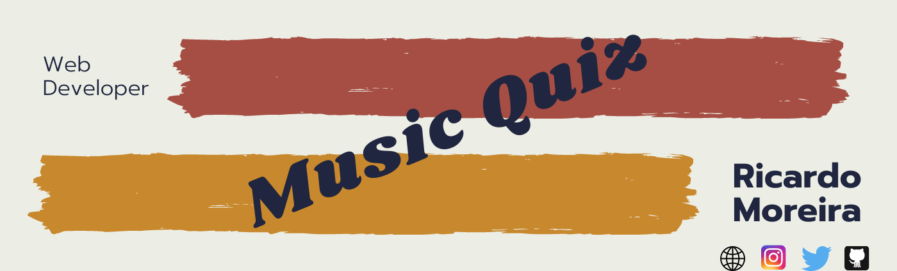
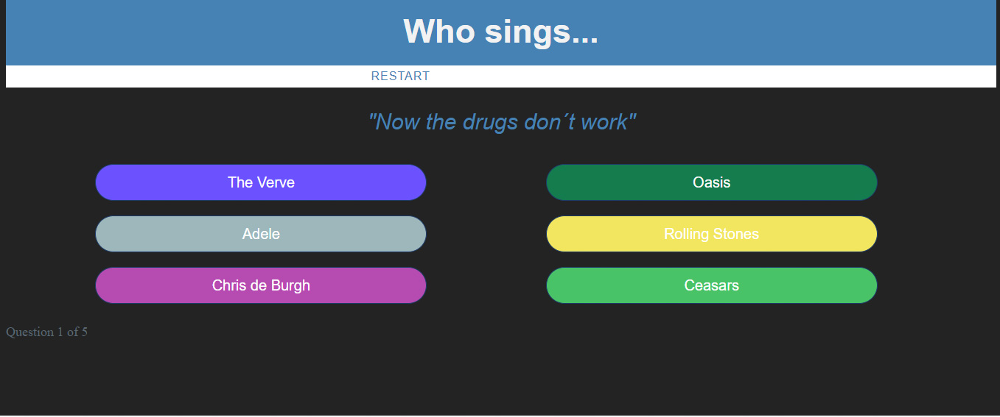
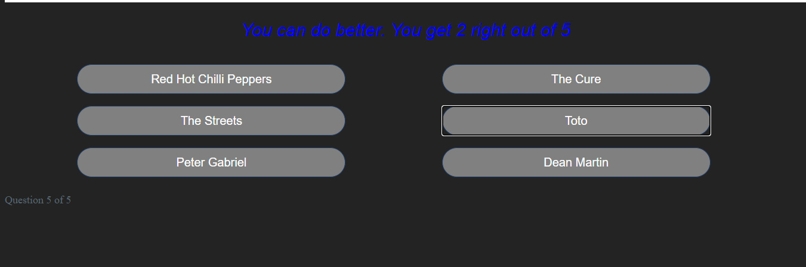

<h1 align="center"> 🔥Music Quiz🔥</h1>

<h2 align="center"> A music quiz made with Javascript and CSS </h2>

### Index

* [Name](#Name) 👈
* [Links](#Links) 🔗
* [Description](#Description) 📖
* [Languages and Frameworks](####Languages-and-Frameworks) ⚙️
* [Screenshots](#Screenshots) 📱
* [Instalation](#Instalation) 🧩
* [Support](#Support) 🆘
* [Roadmap](#Roadmap) 🗺️
* [Authors and acknowledgment](####Authors-and-acknowledgment) ✍️
* [Project Status](#Project-Status) 📜

# Name

Music Quiz

# Links

[Website](https://musicquizgame.netlify.app/)

___

# Description

With just a piece of the lyrics, one has to discover the name of the band. In the end the score will be displayed. In every new game, a new set of colors will be displayed on each band name background.

Based on two tutorials. One from the [web Development Bootcamp](https://www.udemy.com/the-web-developer-bootcamp/), the [color game](https://github.com/mugas/colorfullgame).

After I had done the tutorial, I wanted to create my own version. It took me some time but felt good to see the end result and see how much I have improved after finishing it.

___

# Languages, Frameworks and others

* **Javascript** - Language
* **Css** - Styling

____

# Screenshots

Home Page         |  Blog Page
:-------------------------:|:-------------------------:
  |  

____

# Instalation

___

# Support

Have any question or find something that doesn't look good? Let's talk 😊

[Here](https://github.com/mugas)

[And Here](https://www.ricardomoreira.io/about)

____

# Roadmap

Nothing to add

____

# Authors-and-acknowledgment

* [Based on this](https://www.udemy.com/the-web-developer-bootcamp/)

* Me 😊

____

# Project-Status  

Nothing to add
____
